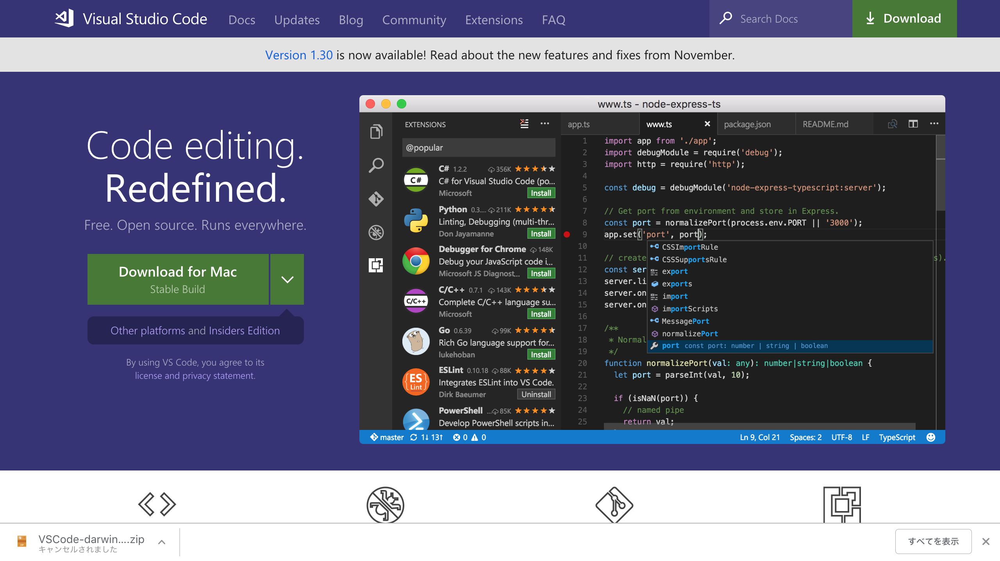

# threejs_tutorial

## Step

### install vscode
[ここ](https://code.visualstudio.com/)を開くと以下の画面が出る

Download for ... のボタンをクリックするとダウンロードが始まる

### VSCodeの拡張機能のインストール 
install (debug for chrome, Live Server, zenkaku, ...) via vscode 
### VSCodeの設定
(等幅フォント(Ricty??)、タブをスペースに変換、[Live Server](https://infosmith.biz/blog/it/vscode-extensions-for-p5js), [debug for chrome](https://infosmith.biz/blog/it/p5js-visualstudiocode)、そのほかプラグイン)

[これ](https://ics.media/entry/14771/2)に沿って進めるー

### optional
1. install nodist
2. install nodejs via nodist ([usage of nodist](https://qiita.com/satoyan419/items/56e0b5f35912b9374305))
3. install Browserify via npm (npm i -g browserify)

## Downloads
- [nodist](https://github.com/nullivex/nodist/releases)
- [Brackets](http://brackets.io/)
- [vsCode](https://code.visualstudio.com/)
- [Github Desktop for windows](https://desktop.github.com/)
